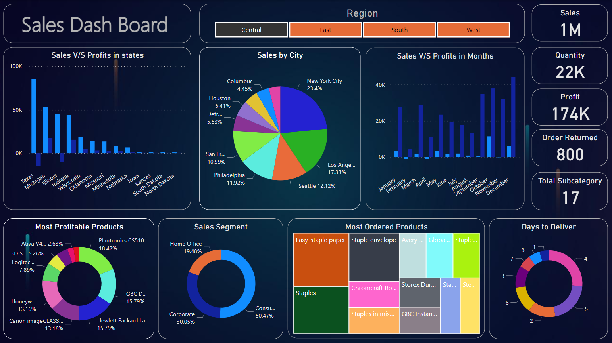

<h1><center>SALES DASHBOARD</center></h1>

* <h4>Description :- </h4>
```
Purpose: This dashboard was designed to analyze sales data, track performance, and
identify in-demand products.

Visualizations: It features interactive charts, graphs, slicers, and cards for a
comprehensive view of sales metrics.

Data Sources: I integrated data collected from kaggle.com.

Insights: Through this project, I gained valuable insights into customer behavior and
revenue patterns.
```

<br>
<br>

* <h4>Technology Used :- </h4>
<br>
<center>
    </img>
</center>


* <h4>ScreenShot :- </h4>
<br>
<center>
    </img>
</center>


